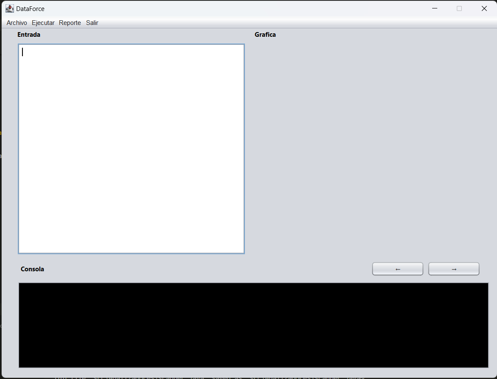
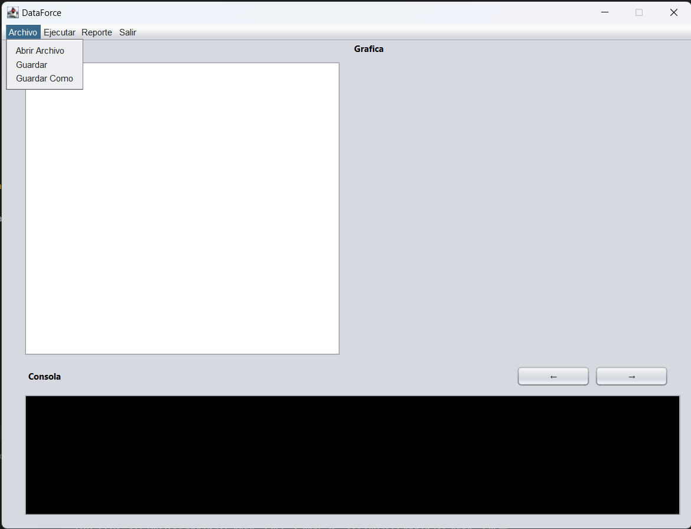
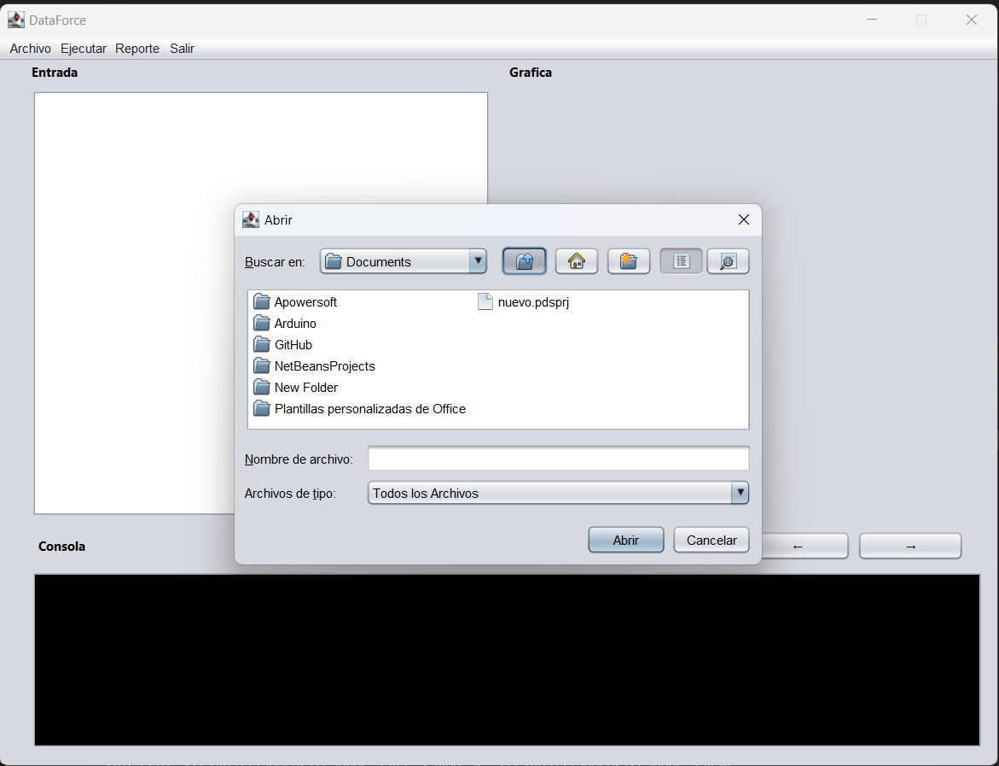
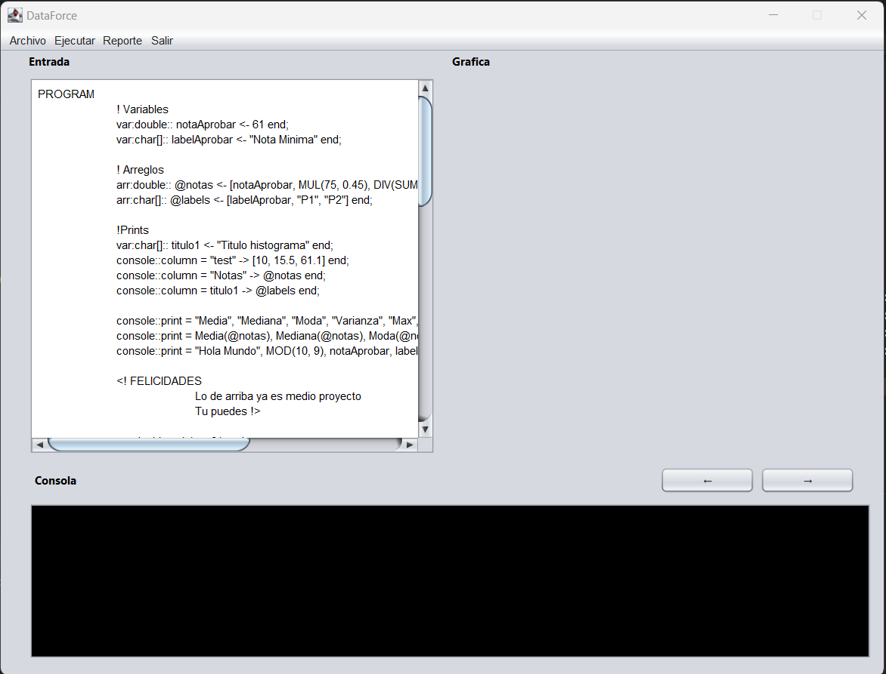
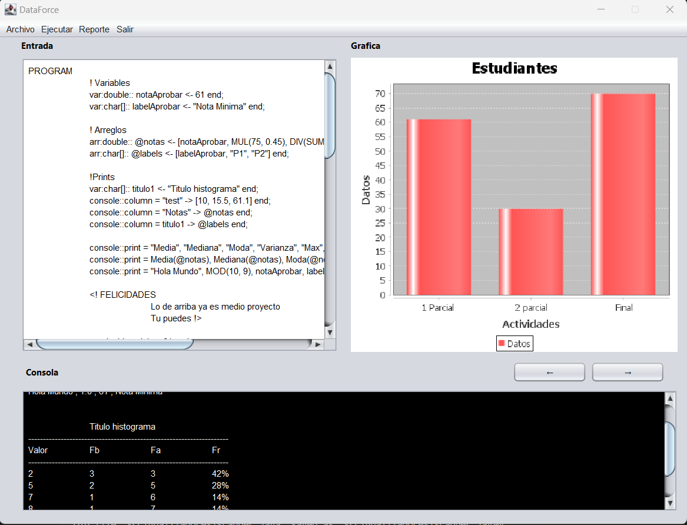
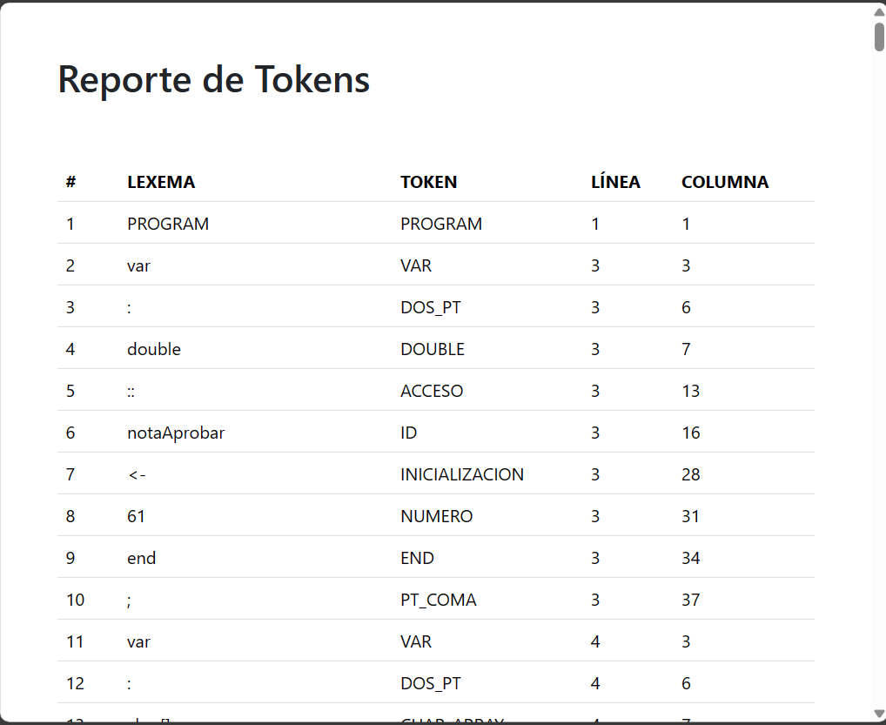

# MANUAL DE USUARIO
## INFORMACIÓN DEL SISTEMA
*Este programa fue creado principalmente pensando en el desarrollo de una aplicación GUI la cual sea capaz de reconocer un lenguaje, dado por medio de un analizador léxico el cual cumple con las reglas establecidas, manejando la lectura y escritura de archivos para el manejo de la información, a través de un entorno gráfico.*

### RECURSOS NECESARIOS
- 2GB de RAM.
- Windows vista o superior.
- Arquitectura de 32 bits o 64 bits.

### OBJETIVOS
- Aprender a generar analizadores léxicos y sintácticos
utilizando las herramientas de JFLEX y CUP.
- Comprender los conceptos de token, lexema, patrones y
expresiones regulares.
- Realizar correctamente el manejo de errores léxicos.
- Realizar acciones gramaticales usando el
lenguaje de programación JAVA
---
## FUNCIONAMIENTO DEL SISTEMA

1. *Al iniciar el programa se muestra una ventana principal con un menu bar.*

2. *El boton archivo contiene otras funcionalidades como abrir archivo, guardar, guardar como que permite visualizar el archivo con extension .df en el text area*
   

3. *Al presionar el boton abrir archivo este muestra una ventana emergente para navegar en los ficheros y ubicar el archivo para poder abrirlo en la interfaz para su posterior analisis.*

4. *Luego de tener el archivo listo puede presionarse el boton de ejecucion para el analisis del archivo de entrada.*
   

5. *Al ejecutar el programa se podran visualizar las graficas y calculos si el archivo de entrada asi los tuviera para el analisis de estos datos.*
   

6. *El boton Reportes contiene mas funcionalidades ademas para mostrar reporte de tokens, errores, tabla de simbolos generadas en un archivo html para su posterior visualizacion.*
   

---